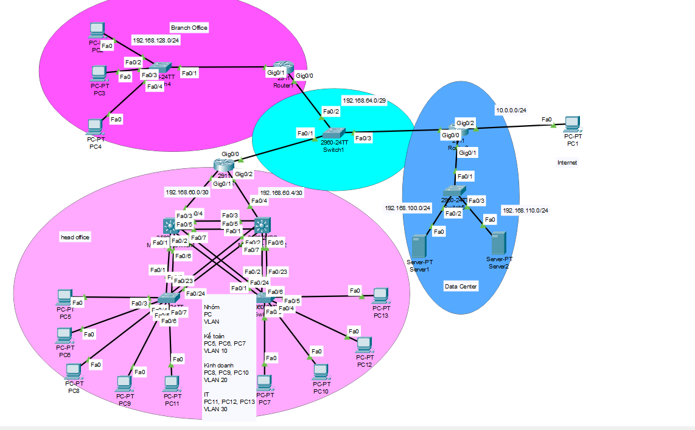
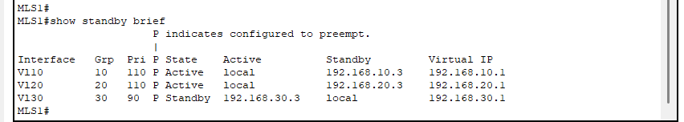
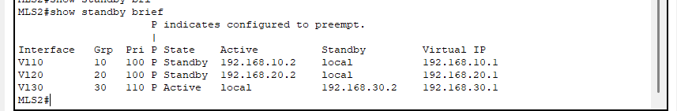
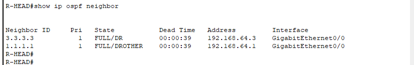

# Enterprise Network Packet Tracer Lab

A Cisco Packet Tracer enterprise network lab that simulates a small multi-site corporate network consisting of a **Head Office**, **Branch Office**, **Data Center**, and an external **Internet network**.

The project focuses on network segmentation, routing, high availability, redundancy, centralized services, Internet access, and basic network security.

---

## Network Topology



---

## Project Objectives

This lab was designed to implement and verify:

- IP addressing and subnet planning
- VLAN segmentation
- Inter-VLAN routing
- HSRP gateway redundancy
- Rapid-PVST load sharing
- EtherChannel using LACP
- OSPF dynamic routing
- Floating static routes
- Centralized Internet access through the Data Center
- DHCP for Branch clients
- Centralized Syslog
- Access Control Lists (ACL)
- Port Security
- NAT/PAT
- HTTPS Web Server publishing

---

## Technologies Used

| Technology | Purpose |
|---|---|
| VLAN | Logical segmentation of departments |
| 802.1Q Trunking | Carry multiple VLANs between switches |
| HSRP | Default gateway redundancy |
| Rapid-PVST | Layer 2 redundancy and VLAN-based load sharing |
| EtherChannel / LACP | Link redundancy and bandwidth aggregation |
| OSPF | Dynamic routing between network sites |
| Static Routing | Backup routing |
| DHCP | Automatic IP allocation at the Branch |
| ACL | Restrict management access |
| Syslog | Centralized device logging |
| Port Security | Layer 2 access-port protection |
| NAT/PAT | Centralized Internet connectivity |
| Static PAT | Publish the HTTPS Web Server |

---

## Network Architecture

The network consists of three main enterprise areas:

### Head Office

The Head Office contains two multilayer switches providing Layer 3 gateway services and network redundancy.

Department VLANs:

| VLAN | Department | Network | Default Gateway |
|---:|---|---|---|
| 10 | Accounting | `192.168.10.0/24` | `192.168.10.1` |
| 20 | Business | `192.168.20.0/24` | `192.168.20.1` |
| 30 | IT | `192.168.30.0/24` | `192.168.30.1` |

HSRP provides the virtual default gateways for all three VLANs.

### Branch Office

The Branch Office uses:

```text
192.168.128.0/24
```

The Branch router provides DHCP services to local clients.

### Data Center

The Data Center contains separate networks for management and application services.

| VLAN | Purpose | Network |
|---:|---|---|
| 100 | Management / Syslog | `192.168.100.0/24` |
| 110 | Application / Web Server | `192.168.110.0/24` |

Key servers:

| Server | IP Address |
|---|---|
| Syslog Server | `192.168.100.100` |
| Web Server | `192.168.110.100` |

---

## Core IP Addressing

| Device | Interface | IP Address |
|---|---|---|
| R-BRANCH | G0/0 | `192.168.64.1/29` |
| R-BRANCH | G0/1 | `192.168.128.1/24` |
| R-HEAD | G0/0 | `192.168.64.2/29` |
| R-HEAD | G0/1 | `192.168.60.1/30` |
| R-HEAD | G0/2 | `192.168.60.5/30` |
| R-DC | G0/0 | `192.168.64.3/29` |
| R-DC | G0/1.100 | `192.168.100.1/24` |
| R-DC | G0/1.110 | `192.168.110.1/24` |
| R-DC | G0/2 | `10.0.0.1/24` |
| MLS1 | Fa0/4 | `192.168.60.2/30` |
| MLS2 | Fa0/4 | `192.168.60.6/30` |

The complete addressing plan is available in:

[IP Addressing Plan](docs/Quy_hoach_IP_Final_Lab.xlsx)

---

## High Availability

### HSRP

HSRP is configured between `MLS1` and `MLS2`.

Load distribution is implemented as follows:

| VLAN | Active Gateway | Standby Gateway |
|---:|---|---|
| 10 | MLS1 | MLS2 |
| 20 | MLS1 | MLS2 |
| 30 | MLS2 | MLS1 |

This design provides gateway redundancy while distributing VLAN gateway roles between both multilayer switches.

### HSRP Verification

#### MLS1



#### MLS2



---

## Spanning Tree

Rapid-PVST is used for Layer 2 redundancy and VLAN-based load sharing.

```text
VLAN 10 → MLS1 Root Primary
VLAN 20 → MLS1 Root Primary
VLAN 30 → MLS2 Root Primary
```

MLS2 acts as the secondary root for VLANs 10 and 20, while MLS1 acts as the secondary root for VLAN 30.

---

## EtherChannel

LACP EtherChannel is used to provide redundant physical links and logical link aggregation between network switches.

### MLS1


### MLS2


Verification command:

```text
show etherchannel summary
```

---

## OSPF Routing

OSPF Process ID `1` is used as the dynamic routing protocol between the Head Office, Branch, Data Center, and multilayer switches.

The lab uses OSPF Area 0.

Example verification:

```text
show ip ospf neighbor
show ip route
```

### OSPF Neighbor Verification



---

## Static Routing

Floating static routes are configured as backup routes with an administrative distance of `200`.

Example:

```text
ip route 0.0.0.0 0.0.0.0 192.168.64.3 200
```

OSPF routes are preferred during normal operation, while the floating static routes provide a backup path.

---

## Centralized Internet Access

Internet access is centralized through the Data Center router (`R-DC`).

Internal enterprise networks use PAT through the Data Center Internet-facing interface.

```text
ip nat inside source list 1 interface g0/2 overload
```

The Data Center also originates the default route into OSPF so that internal sites can reach the simulated Internet through `R-DC`.

---

## DHCP

The Branch router provides DHCP services for:

```text
192.168.128.0/24
```

Example DHCP pool:

```text
ip dhcp pool BRANCH01-PC
 network 192.168.128.0 255.255.255.0
 default-router 192.168.128.1
 dns-server 8.8.8.8
```

Verification:

```text
show ip dhcp binding
show ip dhcp pool
```

---

## Centralized Syslog

All routers and switches send log messages to the centralized Syslog Server located in the Data Center.

```text
Syslog Server: 192.168.100.100
```

Example device configuration:

```text
service timestamps log datetime msec
logging host 192.168.100.100
logging trap informational
```

---

## Management Access Control

Remote device management is restricted to the IT VLAN:

```text
192.168.30.0/24
```

An ACL is applied to the VTY lines to prevent users from Accounting and Business VLANs from remotely accessing network devices.

Expected behavior:

```text
VLAN 30 - IT          → Management access permitted
VLAN 10 - Accounting  → Denied
VLAN 20 - Business    → Denied
```

---

## Port Security

Port Security is configured on access ports connected to end devices.

Example:

```text
switchport mode access
switchport port-security
switchport port-security maximum 1
switchport port-security mac-address sticky
switchport port-security violation restrict
spanning-tree portfast
```

Port Security is not applied to trunk links.

---

## HTTPS Web Server

The internal Web Server is:

```text
192.168.110.100
```

HTTP is disabled and HTTPS is enabled.

The server is published through the Data Center router using static TCP port translation:

```text
ip nat inside source static tcp 192.168.110.100 443 10.0.0.1 443
```

Expected external access:

```text
https://10.0.0.1
```

TCP port `443` is used for external Web access.

---

## Verification Commands

The following commands are useful for validating the lab:

```text
show ip interface brief
show vlan brief
show interfaces trunk
show standby brief
show spanning-tree vlan 10
show spanning-tree vlan 20
show spanning-tree vlan 30
show etherchannel summary
show ip ospf neighbor
show ip route
show ip dhcp binding
show port-security
show access-lists
show logging
show ip nat translations
```

---

## Repository Structure

```text
enterprise-network-packet-tracer-lab/
│
├── README.md
│
├── packet-tracer/
│   └── BAITAPLON_FINAL.pkt
│
├── docs/
│   ├── Final-lab_Requirement.docx
│   └── Quy_hoach_IP_Final_Lab.xlsx
│
├── configs/
│   ├── R-BRANCH.txt
│   ├── R-HEAD.txt
│   ├── R-DC.txt
│   ├── MLS1.txt
│   ├── MLS2.txt
│   ├── SW-TRANSIT.txt
│   ├── SW-ACC1.txt
│   ├── SW-ACC2.txt
│   ├── SW-DC.txt
│   └── SW-BRANCH.txt
│
└── images/
    ├── topology.png
    ├── ospf-neighbors.png
    ├── hsrp-mls1.png
    ├── hsrp-mls2.png
    ├── etherchannel-mls1.png
    └── etherchannel-mls2.png
```

---

## Device Configurations

Device running configurations are available in the [`configs`](configs/) directory.

The complete Packet Tracer topology is available here:

[Open Packet Tracer Lab](packet-tracer/BAITAPLON_FINAL.pkt)

---

## Requirements

To open and test the topology:

- Cisco Packet Tracer
- Basic knowledge of Cisco IOS
- Basic understanding of VLANs, routing, redundancy, and network security

---

## Lab Documentation

- [Lab Requirements](docs/Final-lab_Requirement.docx)
- [IP Addressing Plan](docs/Quy_hoach_IP_Final_Lab.xlsx)

---

## Security Notice

Credentials contained in this repository are used only for the Cisco Packet Tracer lab environment.

They must **not** be reused in production systems.

---

## Author

**khoiduc12345-netizen**

Enterprise Network Design & Cisco Packet Tracer Lab
